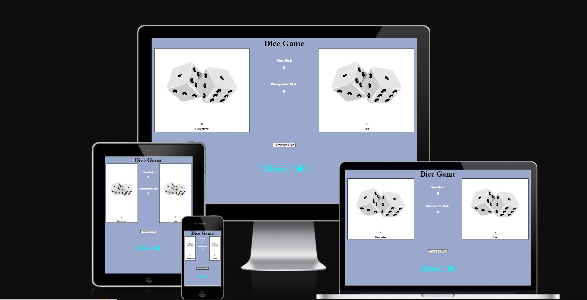
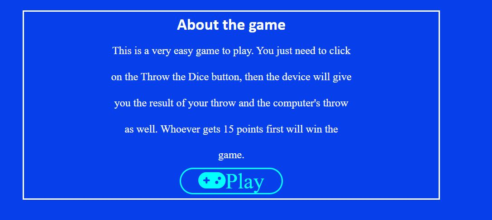
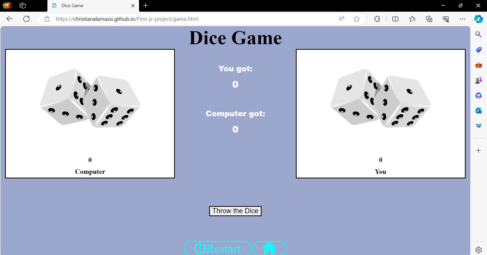

# Dice Game

"Dice Game" is an easy to play userfriendly game for anyone who is looking for a nice passtime without having to concentrate too much, for example when using public transportation or taking a break.The user gets to play against the computer. In clicking a single button, the player and the computer simultaneously throw two dice and the result shows both the player's as well as the computer's score. The throw with the higher number wins the round and gains one point. Whoever has 15 points first, wins the game. The user is then offered to play again which is provided also with the click of one button. The game is programmed with Java Script and the website designed with HTML/CSS.

## Features
"Dice Game" includes two pages. The first page is the introduction site and the second one the game itself. In the following sectors I will go into details for each site individually.

### Homepage
#### This section provides an overview with simple instructions for the user.

 - The heading contains the title of the name, which is "Dice Game".

- The main includes the instructions for the game as well as the "Play" button.

- The footer provides the contact information of the developer for the user. 

### Game Area
#### This section will allow the user to play the "Dice Game". 

- On the top of the page the user can read the title of the game again.

- Underneath are two pictures, each show two dice. Each picture shows the score of each dice throw, the left one shows the computer's score, the one on the right the user's score (which is zero for both at the start of the game, since none of the players has thrown the dice yet.).

Inbetween the pictures it shows the score that adds up the score of each round (as in dice throw) for both players. The user will see how many points they got as well as how many points the computer got. 
Below that there is the "Throw Dice" button, easily to find for the user.

- In the bottom the user gets the options of clicking the "Restart" button or the "Home" button, both easily to identify with added symbols. 

- At the end of the game, meaning either the computer or the user reached 15 points altogether, the user is shown an alert telling them that the game ist over and if they won or lost. The user has to click the "Okay" button on the alert. The screen than shows the result of the game again and the user then gets to choose whether to play again or go back to the homepage. 

## Technologies Used

- [HTML](https://developer.mozilla.org/en-US/docs/Web/HTML) was used as the foundation of the site.
- [CSS](https://developer.mozilla.org/en-US/docs/Web/CSS) was used to add the styles and layout of the site.
- [JavaScript](https://developer.mozilla.org/en-US/docs/Web/JAVASCRIPT) was used for interaction
- [Gitpod](https://www.gitpod.io/) was used for the version control of the website.
- [GitHub](https://github.com/) was used to host the code of the website.

## Design

- The color blue rgba(6, 37, 132, 0.4) and rgb(7, 64, 234) was used in the background because it is very comfrtuble for the eyes.

- Added the scoring area in the middle, between the game area to make it easy to follow the scores
## Accessability
I confirmed that the colors and fonts are clear for the users, by running it through the lighthouse in divtools.

## Testing
- I tested my project in three different browsers (Chrome, Edge and Firefox) and the results were satisfying.

Chrome

Edge

FireFox

- The game was tested on different screen sizes (laptop screens, desktop screens, tablet screens and phone screens) and it was content with the results here as well.

- The game is easy to use and play, the header, and about the game are easy to understand for the user, even the game it self, it's very simble to understand.

### Validator Testing
#### HTML
 No errors were returned when passing through the official [W3C validator](https://validator.w3.org/nu/?doc=https%3A%2F%2Fchristianalamassi.github.io%2FFirst-js-project%2F)

#### CSS
No errors were found when passing through the official [(Jigsaw) validator](https://jigsaw.w3.org/css-validator/validator?uri=https%3A%2F%2Fchristianalamassi.github.io%2FFirst-js-project%2F&profile=css3svg&usermedium=all&warning=1&vextwarning=&lang=en)

#### JavaScript
- some warnings were founded [Jshint validator](https://jshint.com/)

- There are 3 functions in this file.

- Function with the largest signature take 0 arguments, while the median is 0.

- Largest function has 21 statements in it, while the median is 1.

- The most complex function has a cyclomatic complexity value of 5 while the median is 1.

### Unfixed Bugs
- In the end of the score area will show you just 14 points instead 15 points.
- The Click sound isn't available with volume control but isn't loud.

## Deployment

### The site was deployed to GitHub pages through the following steps:

- In the GitHub repository, navigate to the Settings tab
- From the source section drop-down menu, select the main
- Once the main has been selected, the page will be automatically refreshed with a detailed ribbon display to indicate the successful deployment.
- The live link is here [Dice Game](https://christianalamassi.github.io/First-js-project/)

## Credits

### Content
#### Websits were used in coding the game
- To test HTML code[W3](https://validator.w3.org/#validate_by_input)
- To test CSS code[css-validator](https://jigsaw.w3.org/css-validator/)  
- To test JavaScript[Jshint validator](https://jshint.com/)
- To check the program on different screen devices[amiresponsive](https://ui.dev/amiresponsive)
- To get icons for buttons[fontawesome](https://fontawesome.com/) 
- For the Logo of the website[ficon](https://www.favicon.cc/)
- For fonte family[googlefont](https://fonts.google.com/) 
- To check the program in different screen sizs[responsiveviewer](https://responsiveviewer.org)
- For learing from[W3school](https://www.w3schools.com/js/default.asp)

#### inspiration
[Love Maths](https://learn.codeinstitute.net/courses/course-v1:CodeInstitute+LM101+2021_T1/courseware/2d651bf3f23e48aeb9b9218871912b2e/78f3c10a937c4fe09640c7c0098d16bd/?child=first)

### Media
-The images were taken from [pngimg](pngimg.com), 
-The click sound was taken from[pixabay](https://pixabay.com/sound-effects/search/button-click/)